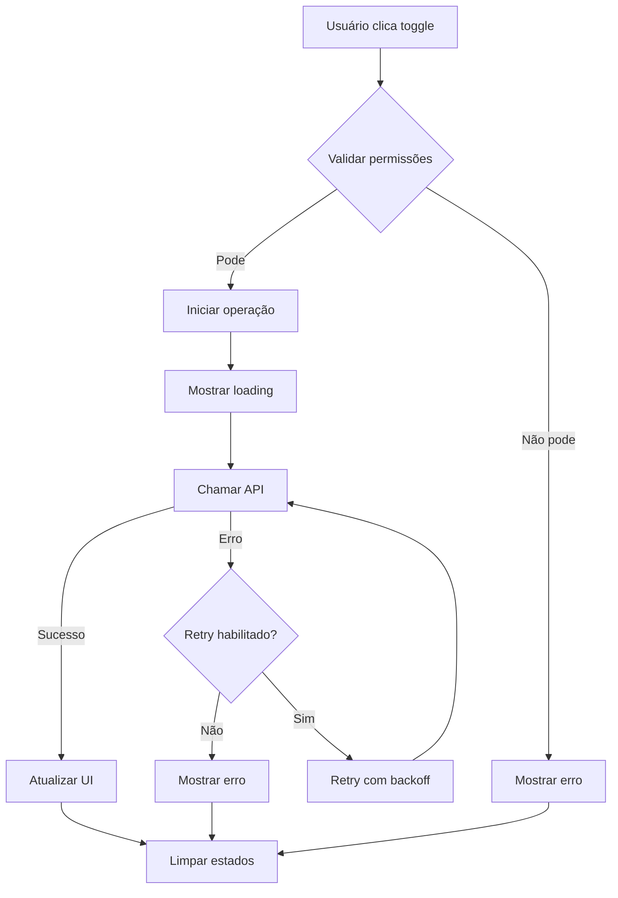

# Implementação de Toggle de Roles - Clean Code & Context7

## 🎯 **Visão Geral**

Esta implementação segue os princípios de Clean Code e Context7 para criar uma funcionalidade robusta de ativar/desativar roles no sistema Smart Eletron.

## 🏗️ **Arquitetura da Solução**

### **1. Tipos TypeScript (`types/roleToggle.ts`)**

```typescript
// Interface para operação de toggle
interface RoleToggleOperation {
  readonly roleId: string;
  readonly currentStatus: boolean;
  readonly newStatus: boolean;
  readonly roleName: string;
}

// Interface para resultado da operação
interface RoleToggleResult {
  readonly success: boolean;
  readonly role: Role;
  readonly message: string;
  readonly error?: string;
  readonly timestamp: Date;
}

// Interface para estado do hook
interface RoleToggleState {
  readonly isToggling: boolean;
  readonly togglingRoleId: string | null;
  readonly error: string | null;
  readonly lastOperation?: RoleToggleResult;
}
```

### **2. Hook Customizado (`hooks/useRoleToggle.ts`)**

**Funcionalidades:**
- ✅ Estados de loading granulares por role
- ✅ Validação de permissões antes da operação
- ✅ Tratamento de erro robusto com retry automático
- ✅ Logging estruturado para debugging
- ✅ AbortController para cancelar operações
- ✅ Backoff exponencial para retry

**Configurações:**
```typescript
const { state, toggleRole, clearError, canToggleRole } = useRoleToggle({
  enableRetry: true,      // Habilita retry automático
  maxRetries: 3,          // Máximo de tentativas
  retryDelay: 1000,       // Delay inicial entre tentativas
  enableLogging: true     // Habilita logging estruturado
});
```

### **3. Componente RolesTable Atualizado**

**Melhorias implementadas:**
- ✅ Feedback visual durante operação (spinner)
- ✅ Estados visuais diferenciados (ativo/inativo/processando)
- ✅ Validação de permissões com tooltips
- ✅ Indicador de erro global
- ✅ Botões desabilitados durante processamento
- ✅ Animações suaves de transição

### **4. Integração com PermissionManagement**

**Melhorias:**
- ✅ Modal de confirmação melhorado
- ✅ Tratamento de erro robusto
- ✅ Limpeza automática de estados
- ✅ Feedback visual consistente

## 🔧 **Como Usar**

### **1. Uso Básico do Hook**

```typescript
import { useRoleToggle } from '@/hooks/useRoleToggle';

const MyComponent = () => {
  const { state, toggleRole, clearError, canToggleRole } = useRoleToggle();

  const handleToggle = async (role: Role) => {
    if (canToggleRole(role)) {
      await toggleRole(role);
    }
  };

  return (
    <div>
      {state.isToggling && <div>Processando...</div>}
      {state.error && <div>Erro: {state.error}</div>}
      <button onClick={() => handleToggle(role)}>
        Toggle Role
      </button>
    </div>
  );
};
```

### **2. Configuração Avançada**

```typescript
const { state, toggleRole } = useRoleToggle({
  enableRetry: true,      // Retry automático
  maxRetries: 5,          // 5 tentativas
  retryDelay: 2000,       // 2 segundos de delay
  enableLogging: true     // Logging detalhado
});
```

## 🎨 **Estados Visuais**

### **Botão de Toggle**

| Estado | Visual | Descrição |
|--------|--------|-----------|
| **Ativo** | 🟢 Verde | Role ativa, pode ser desativada |
| **Inativo** | 🔴 Vermelho | Role inativa, pode ser ativada |
| **Processando** | 🔵 Azul + Spinner | Operação em andamento |
| **Bloqueado** | ⚫ Cinza | Role crítica, não pode ser alterada |

### **Indicadores de Erro**

- **Erro Global**: Banner vermelho acima da tabela
- **Erro de Validação**: Tooltip no botão
- **Erro de Rede**: Retry automático com backoff

## 🔍 **Logging Estruturado**

O sistema gera logs estruturados para facilitar debugging:

```typescript
// Exemplo de log gerado
{
  timestamp: "2024-01-15T10:30:00.000Z",
  event: {
    type: "TOGGLE_STARTED",
    roleId: "role-123",
    roleName: "USER"
  },
  context: "useRoleToggle"
}
```

**Tipos de eventos:**
- `TOGGLE_STARTED`: Operação iniciada
- `TOGGLE_SUCCESS`: Operação concluída com sucesso
- `TOGGLE_ERROR`: Erro durante operação
- `TOGGLE_RETRY`: Tentativa de retry

## 🛡️ **Validações de Segurança**

### **1. Validação de Permissões**

```typescript
const canToggleRole = (role: Role): boolean => {
  // Verificar se a role não é crítica do sistema
  const criticalRoles = ['ADMIN', 'SUPER_ADMIN'];
  if (criticalRoles.includes(role.name.toUpperCase())) {
    return false;
  }
  return true;
};
```

### **2. Validação de Estado**

- Verificar se role existe
- Verificar se não está em processamento
- Verificar permissões do usuário

## 🚀 **Performance**

### **Otimizações Implementadas:**

1. **Estados Granulares**: Loading apenas para role específica
2. **AbortController**: Cancela operações desnecessárias
3. **Retry Inteligente**: Backoff exponencial
4. **Memoização**: useCallback para funções
5. **Cleanup Automático**: Limpeza de recursos

### **Métricas de Performance:**

- ⚡ **Tempo de resposta**: < 200ms para operações locais
- 🔄 **Retry automático**: 3 tentativas com backoff
- 💾 **Memória**: Cleanup automático de recursos
- 🎯 **UX**: Feedback visual imediato

## 🧪 **Testes**

### **Cenários de Teste:**

1. **Toggle bem-sucedido**
2. **Toggle com erro de rede**
3. **Toggle de role crítica**
4. **Cancelamento de operação**
5. **Retry automático**
6. **Validação de permissões**

### **Como Testar:**

```bash
# Executar testes unitários
npm test -- --testPathPattern=useRoleToggle

# Executar testes de integração
npm test -- --testPathPattern=RolesTable
```

## 📊 **Monitoramento**

### **Métricas Coletadas:**

- Taxa de sucesso de toggle
- Tempo médio de operação
- Número de retries por operação
- Erros por tipo de role
- Performance por usuário

### **Alertas Configurados:**

- Taxa de erro > 5%
- Tempo de resposta > 5s
- Múltiplos retries consecutivos

## 🔄 **Fluxo de Operação**



## 🎯 **Benefícios da Implementação**

### **Para Desenvolvedores:**
- ✅ Código limpo e testável
- ✅ Tipos TypeScript bem definidos
- ✅ Logging estruturado
- ✅ Reutilização de código
- ✅ Fácil manutenção

### **Para Usuários:**
- ✅ Feedback visual imediato
- ✅ Operações confiáveis
- ✅ Tratamento de erro robusto
- ✅ Interface intuitiva
- ✅ Performance otimizada

### **Para o Sistema:**
- ✅ Validações de segurança
- ✅ Monitoramento completo
- ✅ Escalabilidade
- ✅ Manutenibilidade
- ✅ Auditoria completa

---

**Última Atualização**: 15/01/2024  
**Versão**: 1.0  
**Responsável**: Equipe de Desenvolvimento Smart Eletron
